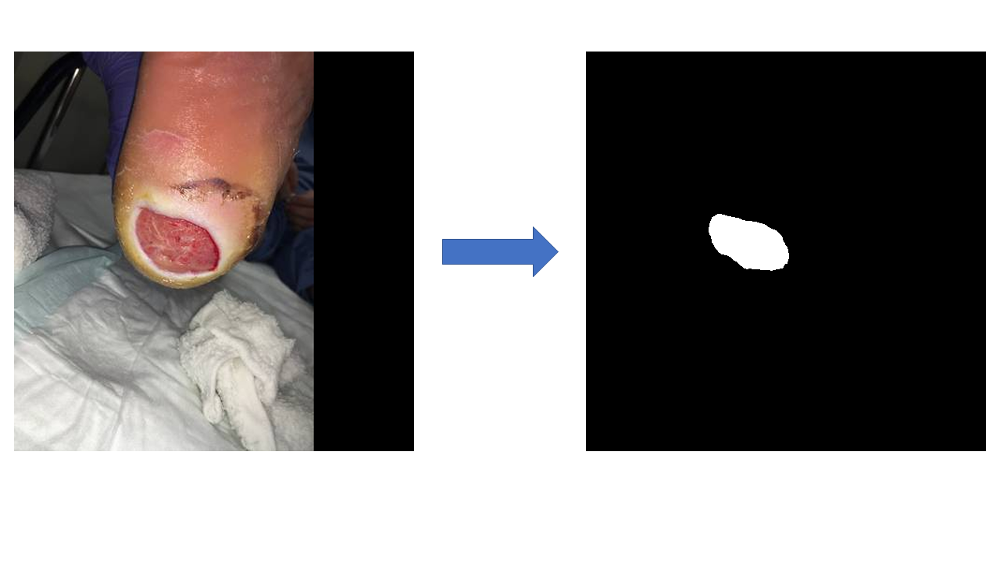

# FootSegONN: An Ensemble of Self-ONN-based Models for Diabetic Foot Ulcer Segmentation

## 📖 Overview
FootSegONN is an ensemble deep learning model utilizing Self-ONN architectures for **diabetic foot ulcer segmentation**. It leverages **segmentation_models.pytorch** for state-of-the-art performance in medical image segmentation.

---


# Examples
<div align=center>



</div>


## 📂 Project Structure  

```plaintext
FootsegONN/
│
├── input/
│   └── ...                  # Contains input data or related files
│
├── models/
│   └── ...                  # Contains model architectures and related scripts
│
├── save_masks/
│   └── ...                  # Directory for saving generated masks
│
├── README.md                # Project documentation and overview
├── SelfONN.py               # Implementation of Self-ONN architectures
├── SelfONN_decoders.py      # Decoders for Self-ONN models
├── ensemble_masks.py        # Script for ensemble mask generation
├── inference.ipynb          # Jupyter notebook for inference
├── models.py                # Script defining model architectures
├── prediction_masks.py      # Script for generating prediction masks
├── requirements.txt         # List of required Python packages
└── selfonnlayer.py          # Implementation of Self-ONN layers


```

## 🚀 Installation Guide

### **1️⃣ Recommended Environment**
- **Python 3.10** (Recommended)
- **pip (Latest Version)**
- **Git (Required for dependencies)**

### **2️⃣ Setup Instructions**
Follow these steps to install and set up the environment:


#### **Step 1: Clone the Repository**
```bash
git clone https://github.com/sumon3255/FootsegONN.git
cd FootSegONN


```


#### **Step 2: Install Dependencies **
```bash

pip install -r requirements.txt

```
```bash

pip install git+https://github.com/qubvel/segmentation_models.pytorch

```

#### **Step 3: Run the following command for prediction **
```bash

python prediction_masks.py

```

#### **Step 4: Run the following command for combined masks **
```bash

python ensemble_masks.py

```
## Citation
If you find this work or code is helpful in your research, please cite:
````
@article{Chowdhury2025FootSegONN,
  author    = {Md. Shaheenur Islam Sumony and Muhammad E. H. Chowdhur  and Saadia Binte Alam and Rashedur Rahman and Rusab Sermun and Md Mezbah Ahmed Mahedi and Zaid Bin Mahbub and Rumana Habib},
  title     = {FootSegONN: An Ensemble of Self-ONN-based Models for Diabetic Foot Ulcer Segmentation},
  journal   = {Neural Computing and Applications},
  publisher = {Springer},
  year      = {2025}
}

````


